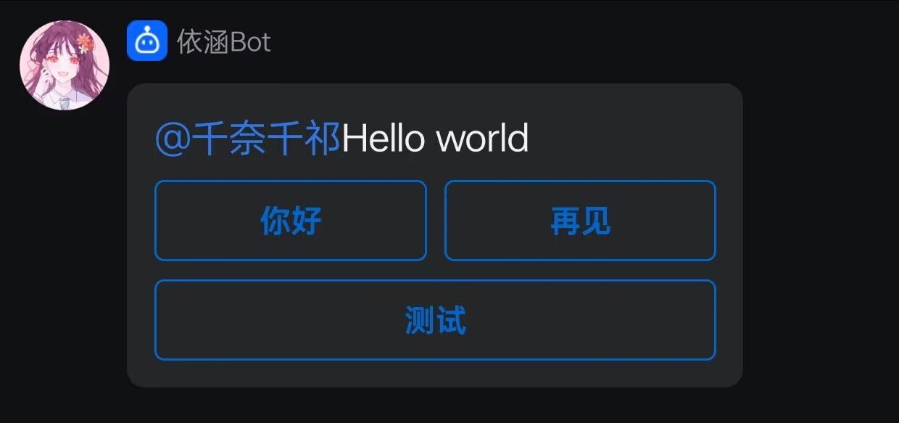

## Karin-plugin-QQBot
### 简介
适用于karin机器人框架的QQBot适配器

### 安装指令
#### Github (Gitee和Github安装指令任选其一)
```
git clone --depth=1 https://github.com/qiannqq/karin-plugin-qqbot.git ./plugins/karin-plugin-qqbot
```
#### Gitee 国内加速源
```
git clone --depth=1 https://gitee.com/qiannqq/karin-plugin-qqbot.git ./plugins/karin-plugin-qqbot
```
#### 使用pnpm安装依赖
```
pnpm i
```

### QQBot接口支持列表

- [ ] 原生markdown、纯文markdown
- [x] 消息按钮、图文模板markdown
- [ ] Lain-drive 图床
- [x] 艾特参数、图片参数、文本参数
- [x] 图文消息、文本消息、markdown消息
- [ ] 语音、视频等富媒体消息

### markdown 设置教程
<details><summary>图文消息</summary>

模板名称：图文消息

使用场景：发送图文混排消息

请复制后去除源码前后的 ` 标记

Markdown 源码：

```
{{.text_start}}{{.text_end}}
```

配置模板参数
| 模板参数   | 参数示例                                                           |
| ---------- | -------------------------------------------------------------------------- |
| text_start | 开头文字                                                           |
| img_dec    | 图片                                                               |
| img_url    | https://qqminiapp.cdn-go.cn/open-platform/11d80dc9/img/robot.b167c62c.png  |
| text_end   | 结束文字                                                           |

保存 → 提交审核 → 审核完成<br>
打开plugins/karin-plugin-qqbot/config/config/Bot.yaml，填写markdown_id为你的模板ID，并开启markdown消息

</details>

<details><summary>纯文模板</summary>

**纯文模板待支持中...**

</details>

<details><summary>消息按钮</summary>

**目前只支持指令按钮**

  - plugins/karin-plugin-qqbot/Button 下为用户自定义按钮
  - plugins/karin-plugin-xxxxx/qqbot-button.js 为插件的按钮 (暂未实现)

***
  - 按钮示例


***

**如何返回按钮数据由开发者(用户)自行决定，plugins/karin-plugin-qqbot/Button/hello.js为示例代码**

| 参数名称 | 类型 | 是否必填 | 说明 |
|---|---|---|---|
| label | string | 是 | 按钮上的文字 |
| data | string | 是 | 指令内容(跳转按钮为跳转链接) |
| visited_label | string | 否 | 按钮点击后显示的文字 |
| style | number | 否 | 按钮边框颜色，0为灰，1为蓝 |
| enter | bool | 否 | 指令按钮可用，点击按钮后直接自动发送data，默认false |


</details>

### 参与贡献

1. Fork本仓库
2. 提交代码
3. 新建 PR